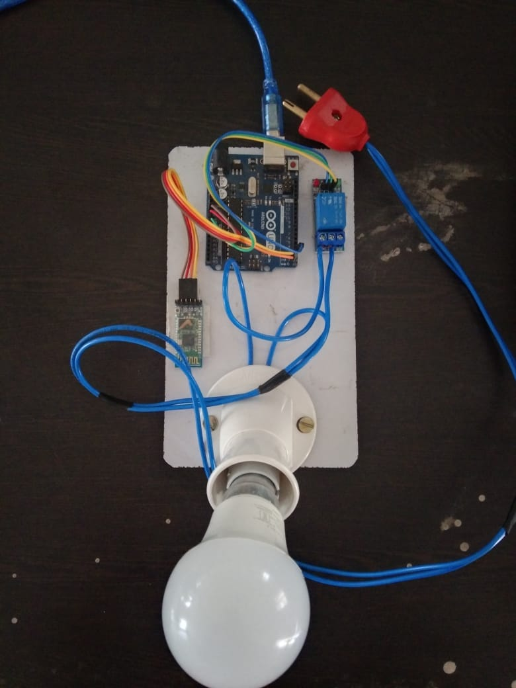
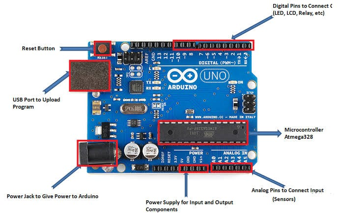
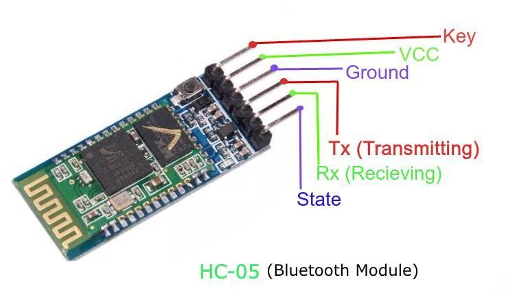
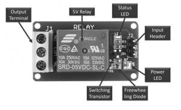
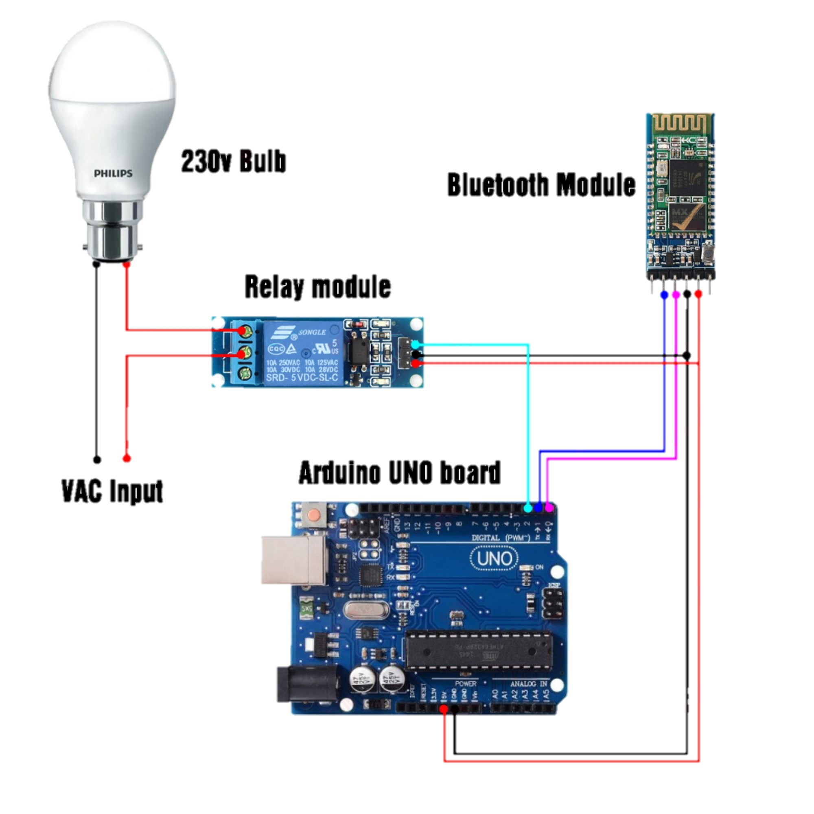
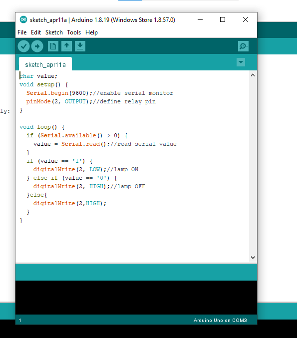
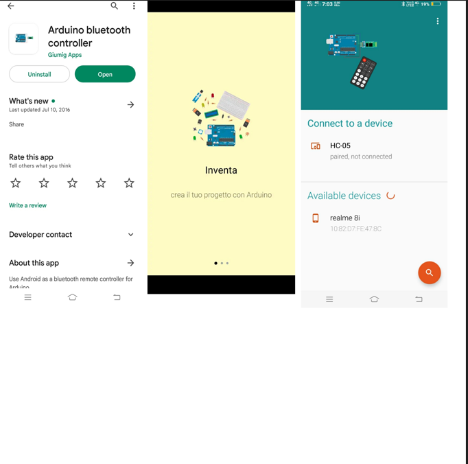
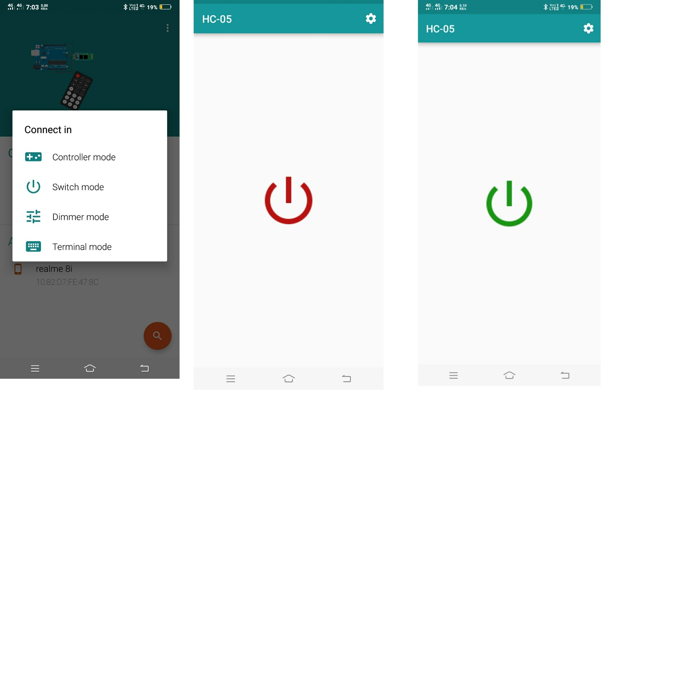

# 🏠 Smartphone Controlled Home Automation System using Arduino Uno & HC-05 Bluetooth

<p align="center">
  
</p>

<p align="center">


</p>

<p align="center">


</p>


A smartphone-controlled home automation system developed using **Arduino Uno**, **HC-05 Bluetooth Module**, and **Relay Module** for wireless control of electrical appliances.

This project was developed as part of the **ECE 6th Semester Major Project (Phase-I)** at the **Indian Institute of Information Technology (IIIT), Bhopal**.

---

# 📑 Table of Contents

- Project Overview
- Features
- Hardware Components
- Software Requirements
- Working Principle
- Circuit Diagram
- Project Structure
- Arduino Program
- Applications
- Future Improvements
- Team Members
- Supervisor
- License

---

# 📖 Project Overview

This project demonstrates a low-cost smart home automation system that enables users to control electrical appliances wirelessly using a smartphone.

The system uses Bluetooth communication between an Android smartphone and an Arduino Uno. Commands sent from the mobile application are received through the HC-05 Bluetooth module and processed by the Arduino, which controls a relay to switch appliances ON or OFF.

---

# ✨ Features

- Wireless appliance control
- Smartphone-based operation
- Bluetooth communication
- Arduino Uno based
- HC-05 Bluetooth module
- Relay module switching
- Low-cost implementation
- Easy to build
- Beginner-friendly embedded systems project

---

# 🛠 Hardware Components

| Component | Quantity |
|------------|----------|
| Arduino Uno | 1 |
| HC-05 Bluetooth Module | 1 |
| Relay Module | 1 |
| AC Bulb |
| Bulb Holder |
| Jumper Wires |
| Power Supply |
| Smartphone |
### Hardware Components Gallery

<table>
<tr>
<td align="center">
<b>Arduino Uno</b><br>

</td>

<td align="center">
<b>HC-05 Bluetooth Module</b><br>

</td>

<td align="center">
<b>Relay Module</b><br>

</td>
</tr>
</table>
---

# 💻 Software Requirements

- Arduino IDE
- Bluetooth Terminal App
- Windows 10/11
- USB Cable

---
## 📸 Project Prototype

The completed hardware prototype of the Smartphone Controlled Home Automation System is shown below.

<p align="center">
  
</p

---

# ⚙ Working Principle

1. User opens the Bluetooth control application.
2. Smartphone connects with HC-05 Bluetooth module.
3. User presses ON or OFF button.
4. Bluetooth module receives the command.
5. Arduino reads the command through Serial Communication.
6. Arduino switches the relay.
7. Relay controls the connected electrical appliance.

---

## 🔌 Circuit Diagram

The complete wiring diagram for the project is shown below.

<p align="center">
  
</p>

### System Architecture

```text
Smartphone
     │
 Bluetooth
     │
 HC-05 Module
     │
 Arduino Uno
     │
 Relay Module
     │
 Electrical Appliance
```

---

# 📂 Project Structure

```
arduino-bluetooth-home-automation
│
├── Arduino_Code
│   └── ON_OFF_System.ino
│
├── Circuit_Diagram
│   └── circuit_diagram.png
│
├── Images
│
├── PPT
│   └── Presentation.pptx
│
├── Report
│   └── Minor_Project_Report.pdf
│
├── LICENSE
├── README.md
└── .gitignore
```

---

# 👨‍💻 Arduino Program

```cpp
char value;

void setup()
{
    Serial.begin(9600);
    pinMode(2, OUTPUT);
}

void loop()
{
    if(Serial.available()>0)
    {
        value=Serial.read();
    }

    if(value=='1')
    {
        digitalWrite(2,LOW);
    }

    else if(value=='0')
    {
        digitalWrite(2,HIGH);
    }
}
```

Complete source code is available inside the **Arduino_Code** folder.
### Arduino IDE

The Arduino sketch was developed and uploaded using the Arduino IDE.

<p align="center">
  
</p>

---
## 📱 Bluetooth Controller Application

The project uses an Android Bluetooth Controller application to send ON/OFF commands to the Arduino through the HC-05 Bluetooth module.

### Application Screenshots

<table>
<tr>
<td align="center">
<b>Bluetooth Connection Screen</b><br>

</td>

<td align="center">
<b>Button Configuration</b><br>

</td>
</tr>
</table>

# 📱 Applications

- Home Automation
- Smart Homes
- Embedded Systems Learning
- Wireless Switching
- College Projects
- Arduino Learning
- IoT Foundation

---

# 🚀 Future Improvements

- ESP32 Integration
- Wi-Fi Control
- Alexa Support
- Google Home Integration
- Blynk IoT Platform
- Mobile Application Development
- Voice Control
- Cloud Monitoring

---

# 👥 Team Members

**Group 10**

- Arpeet Bhaisare
- Abhishek Brajvasi
- Srirama Aniketh
- Samarth Varshney

---

# 👨‍🏫 Supervisor

**Dr. Bhupendra Singh Kirar**

Assistant Professor

Indian Institute of Information Technology, Bhopal

---

# 🎓 Academic Information

**Institute**

Indian Institute of Information Technology (IIIT), Bhopal

**Department**

Electronics & Communication Engineering

**Semester**

6th Semester

**Academic Year**

2022–23

---

# 🤝 Contributions

Contributions, suggestions, and improvements are welcome.

If you found this repository helpful, please consider giving it a ⭐.

---

# 📄 License

This project is licensed under the MIT License.

See the LICENSE file for details.
